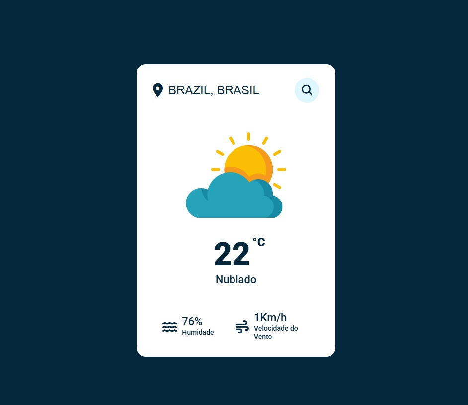

# 🌤️ Aplicativo de Clima - Temperatura App

Este projeto é um aplicativo web que permite ao usuário consultar o clima de qualquer cidade do mundo em tempo real, com dados como temperatura, descrição do tempo, umidade e velocidade do vento — tudo traduzido para o português.

## 🔧 Tecnologias Utilizadas

- HTML5
- CSS3
- JavaScript
- [OpenWeatherMap API](https://openweathermap.org/api)
- [Font Awesome](https://fontawesome.com)

## 📦 Funcionalidades

- Busca por cidade
- Exibição de:
  - Temperatura atual
  - Descrição do clima 
  - Umidade do ar
  - Velocidade do vento
  - Nome do país em inglês e português
- Mensagem de erro amigável para localizações inválidas
- Design responsivo e moderno

## 🖼️ Exemplo

## 🚀 Como usar

1. Clone este repositório
2. Abra o arquivo `index.html` em seu navegador
3. Digite uma cidade e pressione o botão de busca

## 👥 Desenvolvedor:

- Arthur Canaverde  

---

